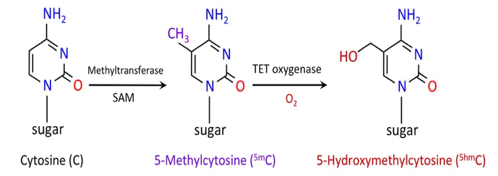

# Epigenetics
_Epigenetics_ refers to changes in gene expression that do not involve alterations to the underlying DNA sequence. These changes are influenced by environmental factors, lifestyle, and developmental stages.

---

<!--

-->

## What is Epigenetics?

Epigenetics explores how genes are turned on or off without changing the genetic code itself. Key mechanisms include:

- **DNA Methylation**: Addition of methyl groups to DNA molecules, typically silencing gene expression.
- **Histone Modification**: Changes to proteins around which DNA is wound, affecting gene accessibility.
- **Non-Coding RNA**: Molecules that regulate gene expression without coding for proteins.

These processes play crucial roles in development, adaptation, and disease progression.

---

## Key Concepts

### 1. **Gene Regulation**
Epigenetic mechanisms act as switches and dimmers for genes, determining:
- Which genes are active (expressed).
- When and how strongly they are expressed.

### 2. **Environmental Influence**
Factors such as diet, stress, and exposure to toxins can modify epigenetic markers, affecting health and traits.

### 3. **Inheritance**
Epigenetic modifications can sometimes be passed to offspring, influencing traits across generations.

---

## Real-World Applications

### 1. **Medicine**
- Understanding diseases like cancer, where abnormal methylation patterns are common.
- Development of epigenetic therapies targeting these modifications.

### 2. **Agriculture**
- Enhancing crop resilience by leveraging epigenetic changes induced by environmental stress.

### 3. **Personalized Health**
- Epigenetic testing to guide lifestyle changes and improve health outcomes.

---

## Case Study: Dutch Hunger Winter
During WWII, a famine in the Netherlands led to significant changes in the epigenetic markers of individuals born during that period. These individuals exhibited:
- Increased risk of diabetes, obesity, and cardiovascular diseases.
- Evidence of epigenetic changes in their offspring.

This illustrates how environmental factors can have multi-generational effects.

---

## Key Terms

| Term               | Definition                                                                 |
|--------------------|-----------------------------------------------------------------------------|
| **Epigenome**      | The complete set of epigenetic modifications across an organism's genome.  |
| **Methylation**    | The addition of methyl groups to DNA, often silencing genes.               |
| **Histones**       | Proteins around which DNA winds, affecting gene accessibility.             |
| **Non-Coding RNA** | RNA molecules that regulate gene expression without coding for proteins.   |

---

## Further Reading

- [National Human Genome Research Institute - Epigenomics](https://www.genome.gov/genetics-glossary/Epigenomics)
- [Epigenetics on Nature.com](https://www.nature.com/subjects/epigenetics)
- [NIH Epigenetics Overview](https://www.nih.gov/news-events/epigenetics-overview)

---

## Summary

Epigenetics bridges the gap between genetics and environmental influences, providing insight into how gene expression can adapt over a lifetime and across generations. It is a rapidly evolving field with profound implications for health, agriculture, and biology.

---
<!--
_This page is part of a Just the Docs site. Learn more about epigenetics in our [Biology section](../biology/)._  
-->