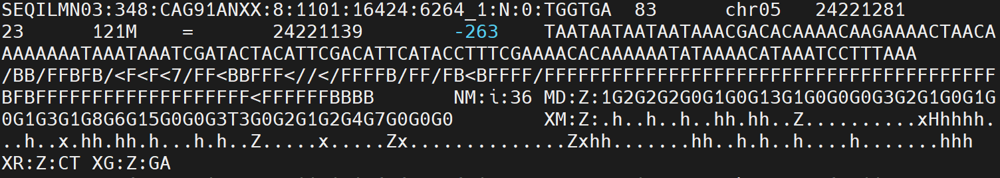

FINAL VERSION
{: .label .label-green }

<br>
<details open markdown="block">
  <summary>
    <strong>Table of contents</strong>
  </summary>
  {: .text-delta }
- TOC
{:toc}
</details>
<br>


<a id="bismark-bam"></a>
# Bismark BAM/SAM output (default)

By default, Bismark generates SAM output for all alignment modes. Please note that reported quality values are encoded in Sanger format (Phred 33 scale), even if the input was in Phred64.

SEQILMN03:348:CAG91ANXX:8:1101:16424:6264_1:N:0:TGGTGA

The file is a linear file tab separated with 16 columns.
For example:




1. `QNAME` (read name)
2. `FLAG` (this flag tries to take the strand a bisulfite read originated from into account (this is different from ordinary DNA alignment flags!))
3. `RNAME` (reference chromosome)
4. `POS` (start position)
5. `MAPQ` (calculated for Bowtie 2 and HISAT2)
6. `CIGAR`
7. `RNEXT`
8. `PNEXT`
9. `TLEN`
10. `SEQ`
11. `QUAL` (Phred33 scale)
12. `NM-tag` (edit distance to the reference)
13. `MD-tag` (base-by-base mismatches to the reference) 
14. `XM-tag` (methylation call string)
15. `XR-tag` (read conversion state for the alignment) 
16. `XG-tag` (genome conversion state for the alignment)

The mate read of paired-end alignments is written out as an additional separate line in the same format.
<!--
[Back to the tutorial](https://gabbo89.github.io/EEA2024-2025/docs/3a1_WGBS_cleaning_and_alignment.html#bismark-bam)
-->

## Methylation call

The methylation call string contains a dot `.` for every position in the read not involving a cytosine, or contains one of the following letters for the three different cytosine methylation contexts:
   **UPPER CASE = METHYLATED**
   **lower case = unmethylated**


- `z` - C in CpG context - unmethylated
- `Z` - C in CpG context - methylated
- `x` - C in CHG context - unmethylated
- `X` - C in CHG context - methylated
- `h` - C in CHH context - unmethylated
- `H` - C in CHH context - methylated
- `u` - C in Unknown context (CN or CHN) - unmethylated
- `U` - C in Unknown context (CN or CHN) - methylated
- `.` - not a C or irrelevant position

[Back to the tutorial](https://gabbo89.github.io/EEA2024-2025/docs/3a1_WGBS_cleaning_and_alignment.html#bismark-bam)


<a id="meth_extract"></a>
# Bismark methylation extractor

`bismark_methylation_extractor` will produce a strand-specific output which will use the following abbreviations in the output file name that indicate the strand the alignment came from:

> OT    - original `TOP` strand
>
> CTOT  - complementary to original `TOP` strand
>
> OB    - original `BOTTOM` strand
>
> CTOB  - complementary to original `BOTTOM` strand

{: .note }
Methylation calls from OT and CTOT will be informative for cytosine methylation positions on the original top strand, calls from OB and CTOB will be informative for cytosine methylation positions on the original bottom strand. Please note that specifying the --directional (the default mode) option in the Bismark alignment step will not report any alignments to the CTOT or CTOB strands.

The methylation extractor output looks like this (tab separated):

1. **seq-ID**
2. **methylation state***
3. **chromosome**
4. **start position _(= end position)_**
5. **methylation call**

* Methylated Cs receive a '+' orientation,
* Unmethylated Cs receive a '-' orientation.


For example, the first rows of the file in CpG context `CpG_OT_rkatsiteli.leaves.rkatsiteli.leaves.R1_bismark_bt2_pe.deduplicated.txt.gz`:

```
Bismark methylation extractor version v0.24.2
SEQILMN03:348:CAG91ANXX:8:1101:20338:9310_1:N:0:TGGTGA  -       chr05   24422926        z
SEQILMN03:348:CAG91ANXX:8:1101:20338:9310_1:N:0:TGGTGA  -       chr05   24422932        z
SEQILMN03:348:CAG91ANXX:8:1101:20338:9310_1:N:0:TGGTGA  -       chr05   24423064        z
SEQILMN03:348:CAG91ANXX:8:1101:3795:9687_1:N:0:TGGTGA   -       chr05   24228001        z
SEQILMN03:348:CAG91ANXX:8:1101:3795:9687_1:N:0:TGGTGA   +       chr05   24228039        Z
```


## (Optional) BedGraph output
{: .no_toc }
The Bismark methylation extractor can optionally also output a file in bedGraph format which uses 0-based genomic start and 1- based end coordinates. The file `*bedGraph.gz` will be sorted by chromosomal coordinates and looks like:
The columns are as follows:
1. **chromosome**
2. **start position**
3. **end position**
4. **methylation percentage**

For example, the first rows of the file in CpG context `rkatsiteli.leaves_pe.deduplicated.bedGraph.gz`:

```
track type=bedGraph
chr05   52260   52261   0
chr05   52261   52262   0
chr05   52262   52263   0
chr05   52276   52277   0
chr05   52278   52279   0
chr05   52288   52289   0
chr05   52294   52295   0
```

<br>

Since the methylation percentage is _per se_ not informative of the read coverage at the specific position, a `*bismark.cov.gz` file is also created (using 1-based genomic coordinates) that feature 2 additional columns, which add the read coverage of detected methylated or unmethylated reads at a position:
1. **chromosome**
2. **start position**
3. **end position**
4. **methylation percentage**
5. **number of methylated Cs**
6. **number of unmethylated Cs**

For example, the first rows of the file in CpG context `rkatsiteli.leaves_pe.deduplicated.bismark.cov.gz`:

```
chr05   52261   52261   0       0       1
chr05   52262   52262   0       0       1
chr05   52263   52263   0       0       1
chr05   52277   52277   0       0       1
chr05   52279   52279   0       0       1
chr05   52289   52289   0       0       1
chr05   52295   52295   0       0       1
chr05   52301   52301   0       0       1
chr05   52325   52325   0       0       1
```
<!--
[link to descriptor](/docs/2a_file_formats.md)
From this file, downstream processing of the file. 
-->

{: .note}
Only performed by default on CG sites


## M-bias output 
{: .no_toc }
<!--
This allows generating nice graphs by alternative means, e.g. using R or Excel. The plot is also drawn into a .png file which requires the Perl module GD::Graph (more specifically, both modules GD::Graph::lines and GD::Graph::colour are required); if GD::Graph cannot be found on the system, only the table will be printed.
-->
The Bismark methylation extractor produces a file in M-bias format which uses 0-based genomic start and 1- based end coordinates. The file shows the methylation proportion across each possibile position in the read (cumulatively)[^2]

The output is a tabular file with the following format:
1. **read position**
2. **count methylated**
3. **count unmethylated**
4. **% methylation**
5. **total coverage**

This allows generating nice graphs by alternative means, e.g. using R or Excel. That should look like:


## Splitting_report
{: .no_toc }
The Bismark methylation extractor produces also a reporting summary. It represent a summary of the splitting step executed by bismark_methylation_extractor. It report the % of methylated Cs in the different contexts. The file is a textual file.


## (Optional) Genome-wide cytosine report output
{: .no_toc }
The `coverage` ouput of the methylation extractor can be trasformed into a genome-wide cytosine methylation report. The main difference compared to the bedGraph is that **EVERY** cytosine on both the TOP and BOTTOM strands will be considered irrespective of wether they were actually covered by any reads in the experiment or not. The option `--genome_folder` need to be used in combination, because it is necessary to specify the reference used for the alignment. By default, only Cs in CpG context are sorted, but the option `--CX_context` may be used to report all Cs irrespective of sequence context. The file **`*CX_report.txt.gz`** is a tab-delimited file with the following columns:

1. **chromosome**
2. **position**
3. **strand**
4. **count methylated**
5. **count non-methylated**
6. **C-context**
7. **trinucleotide context**

For example, the first rows of the file in CpG context `rkatsiteli.leaves_pe.deduplicated.CX_report.txt.gz`:

```
chr05   1       +       0       0       CHH     CCC
chr05   2       +       0       0       CHH     CCT
chr05   3       +       0       0       CHH     CTA
chr05   8       +       0       0       CHH     CCC
chr05   9       +       0       0       CHH     CCT
chr05   10      +       0       0       CHH     CTA
chr05   15      +       0       0       CHH     CCC
chr05   16      +       0       0       CHH     CCT
chr05   17      +       0       0       CHH     CTA
chr05   22      +       0       0       CHH     CCC
```
<br>

In addition the counts of each cytosine context are recorder and stored in a file called `*.cytosine_context_summary.txt`. The report looks at 2 bp downstream, as well as 1 bp upstream of the cytosine taking part in the methylation call. This is useful for looking at methylation in specific contexts (e.g. `CpA` only), and also when using `GpC` methylases that introduce methylation in `GpC` context. The report looks like this: 

```
upstream  C-context  full context  count methylated  count unmethylated  percent methylation
A         CAA        ACAA          2162              106714              1.99
C         CAA        CCAA          2927              82713               3.42
G         CAA        GCAA          1352              65155               2.03
T         CAA        TCAA          2882              125120              2.25
A         CAC        ACAC          338               41769               0.80
C         CAC        CCAC          296               38560               0.76
G         CAC        GCAC          201               26655               0.75
```

[Back to the tutorial](https://gabbo89.github.io/EEA2024-2025/docs/3a1_WGBS_cleaning_and_alignment.html#bismark-meth_extract)


[^2]: https://genomebiology.biomedcentral.com/articles/10.1186/gb-2012-13-10-r83