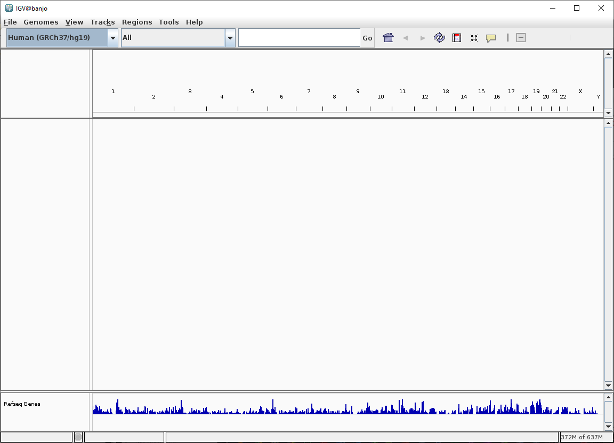

<!--
You can select the color-scheme for the tutorial: <button class="btn js-toggle-dark-mode">Preview dark color scheme</button>

<script>
const toggleDarkMode = document.querySelector('.js-toggle-dark-mode');

jtd.addEvent(toggleDarkMode, 'click', function(){
  if (jtd.getTheme() === 'dark') {
    jtd.setTheme('light');
    toggleDarkMode.textContent = 'Preview dark color scheme';
  } else {
    jtd.setTheme('dark');
    toggleDarkMode.textContent = 'Return to the light side';
  }
});
</script>
-->
Final version
{: .label .label-green }

{: .important-title }
> Aim
>
> During this tutorial we will analyse Illumina Whole Genome Bisulphite Sequencing (WGBS) data, which is a type of sequencing data that is used to study DNA methylation. We will learn how to clean and align the raw data to prepare it for downstream analysis. This will involve understanding the different types of data that are generated by the sequencing process, how to handle missing data, and how to use bioinformatics tools to align the data to the reference genome.
> 

<br>
<details open markdown="block">
  <summary>
    <strong>Table of contents</strong>
  </summary>
  {: .text-delta }
- TOC
{:toc}
</details>

<!--
---

- [Quality control](#1-First-step-check-fastq-quality-using-fastqc-software)
    - [FastQC](#fasta)
- [Trimming](#2-second-step-perform-trimming-of-raw-data)
    - [Trimgalore](https://gabbo89.github.io/EEA2024-2025/docs/2a_TrimGalore_manual.html)
- [Alignment](#3-Alignment-of-fastq-files)
    - [Bismark](https://gabbo89.github.io/EEA2024-2025/docs/2a_Bismark_manual.html)

-->

---

# 1. Quality control and trimming of raw fastq files
Sequencing raw data are divided in read1 and read2 and stored in `fastq` format. Fastq files are compressed in `gzip` format (*.fastq.gz).

We need to check the quality of the raw data in order to be sure that sequencing worked!

We will use FastQC software to verify if raw data quality is appropriate and thus planning the quality trimming.
Fastqc is available both as graphical and textual interface (we will use the textual).  


## a. Check fastq quality using fastqc software 

### Activate the conda environment
{: .no_toc }
```bash
conda activate epigenomics
```

### Test if fastqc is working
{: .no_toc }
```bash
fastqc --help
```

{: .success-title }
> STDOUT
>
>
>            FastQC - A high throughput sequence QC analysis tool
>
>SYNOPSIS
>
>        fastqc seqfile1 seqfile2 .. seqfileN
>
>    fastqc [-o output dir] [--(no)extract] [-f fastq|bam|sam]
>           [-c contaminant file] seqfile1 .. seqfileN
>

### Set the working directory
{: .no_toc }
```bash
# move to the working directory
cd /data2/student_space/st24_16_folder

# create the folder structure
mkdir -p epigenomics/wgbs/sequences

# move to the new working directory
cd epigenomics/wgbs
```

### Copy the raw data from the folder to our working directory
{: .no_toc }
```bash
cp /data2/biotecnologie_molecolari_magris/epigenomics/wgbs/sequences/rkatsiteli.leaves.R*.fastq.gz sequences/
```
<!--
cd /projects/novabreed/share/gmagris/collaboration/lezioni/2024/EEA/wgbs/teaching_dataset
-->

### Run Fastqc 
{: .no_toc }


```bash
# Create the output directory where the fastqc results will be stored
mkdir -p sequences/rkatsiteli_leaves

# run fastqc specifying the input fastq files 
fastqc \
sequences/rkatsiteli.leaves.R1.fastq.gz \
sequences/rkatsiteli.leaves.R2.fastq.gz \
-o sequences/rkatsiteli_leaves
```

##### Check the output files obtained
{: .no_toc }

The output of fastqc is a html file with different plots. It is possible to open it with a browser. Browse to the location where the files are located. You should see a folder with the name of the sample and inside it a html file with the name. Open it with a browser. 

You should see different plot, for example:


| **Per base sequence quality** | **Per base sequence content** |
|:--------:|:---:|
|    |   |


 The most important are the following:
- **Per base sequence quality**: This plot shows the quality of each base in the sequence. The quality is measured in Phred score. The higher the score, the better the quality. The average quality of the bases should be above 20. If the average quality is below 20, it means that the sequencing was not good and the data should be discarded.
- **Per sequence quality scores**: This plot shows the quality of each sequence. The quality is measured in Phred score. The higher the score, the better the quality. The average quality of the sequences should be above 20. If the average quality is below 20, it means that the sequencing was not good and the data should be discarded.
- **Per base sequence content**: This plot shows the frequency of each base in the sequence. The frequency of each base should be around 25%. If the frequency of a base is higher or lower than 25%, it means that there is a bias in the sequencing and the data should be discarded.
- **Per sequence GC content**: This plot shows the GC content of each sequence.
- **Sequence length distribution**: This plot shows the length of each sequence. The length of the sequences should be around the same size. 
- **Sequence duplication levels**: This plot shows the level of duplication in the sequences. The level of duplication should be low (around 1). If the level of duplication is high, it means that the data may have some contamination and thus further filter may be required.
- **Overrepresented sequences**: This plot shows the sequences that are overrepresented in the data. If there are sequences that are overrepresented, it means that there is a bias in the sequencing and the data should be discarded.

{: .note }
It is important to look at the different plots to evaluate the quality of the data. If the quality of the data is good, it can be used for further analysis. If the quality of the data is not good, we have different options.

{: .note }
The quality of the data can be improved by trimming the data. Trimming removes low quality bases from the data. Trimming can be done with software such as Trim Galore.

{: .note }
 If the data is not good quality, it should be discarded. 

<!--
Refer to the powerpoint presentation for additional informations.  
-->

----

## b. Perform trimming of raw data 

Once the quality is evaluated we can procede by removing low quality bases from the fastq files.
Native reads will be subject to quality and adapter trimming before the alignment. Clipping of additional bases at 5' and/or 3' end may deemed necessary in certain circumstances.

We will use TrimGalore to remove adapter and low quality data from fastq file [TrimGalore short manual][trimgalore short manual]{: .btn } and [TrimGalore on Github][trimgalore_github]{: .btn }

We will use it with a reduced set of options, but remember that there are many options available that can be used to customize the trimming process.

##### The options we will use:
{: .no_toc }

- `--path_to_cutadapt cutadapt` trimming software loading
- `--phred33`  Phred quality scores (DEFAULT)
- `--illumina` for Illumina adapters
- `--paired` for paired sequences
- `--output_dir` define the output directory instead of the current directory
<!--- `--trim1` to elude the software that discards overlapping reads-->

This extra options can be used to trim the reads both at 5' and/or 3' end.

- `--clip_R1 1` cut 1 nt in R1 at 5’ end
- `--clip_R2 1` cut 1 nt in R2 at 5’ end
- `--three_prime_clip_R1 4`  cut 4 additional nt at 3’ end
- `--three_prime_clip_R2 4`  cut 4 additional nt at 3’ end

```bash
trim_galore \
--path_to_cutadapt cutadapt \
--phred33 --illumina \
--paired \
--three_prime_clip_R1 2 \
--three_prime_clip_R2 2 \
--clip_R1 1 \
--clip_R2 1 \
--output_dir sequences/ \
--basename rkatsiteli.leaves \
sequences/rkatsiteli.leaves.R1.fastq.gz sequences/rkatsiteli.leaves.R2.fastq.gz
```
<!--
```bash
trim_galore \
--path_to_cutadapt cutadapt \
--phred33 --illumina \
--paired \
--trim1 \
--clip_R1 20 \
--clip_R2 6 \
--three_prime_clip_R1 4 \
--three_prime_clip_R2 4 \
[file R1.fastq.gz pathway] [file R2.fastq.gz pathway]
```
-->


{: .success-title }
> STDOUT
>
>Total number of sequences analysed: 311195
>
>Number of sequence pairs removed because at least one read was shorter 
>than the length cutoff (20 bp): 64 (0.02%)
>
>Deleting both intermediate output files rkatsiteli.leaves_R1_trimmed.fq.gz 
>and rkatsiteli.leaves_R2_trimmed.fq.gz
>
>
>====================================================================================================

TrimGalore will create different files. Validated reads will be saved in `rkatsiteli.leaves_val_1.fq.gz and rkatsiteli.leaves_val_2.fq.gz` files. Additionally a report is also created separately for `R1` and `R2` files. The report will contain information about the number of sequences removed because of the length of the reads or because of the presence of adapters.


### Perform a second round of quality control on the trimmed data using fastQC
{: .no_toc }

```bash
fastqc \
sequences/rkatsiteli.leaves_val_1.fq.gz \
sequences/rkatsiteli.leaves_val_2.fq.gz \
-o sequences/rkatsiteli_leaves
```

Check the obtained figures from the output folder in order to evaluate the quality of the processed data. If you compare with the previous results, you should see a slight improvement in the quality of the data. 

| **Per base sequence quality** | **Per base sequence content** |
|:--------:|:---:|
|    |   |

---

# 2. Alignment of fastq files and post-processing of the data
Once the raw fastq files have been filtered in order to remove potential contaminants and adapters, we are ready to perform the alignment, given a reference genome.


In order to perform the alignment we will use the Bismark suite [Bismark short manual](https://gabbo89.github.io/EEA2024-2025/docs/2a3_Bismark_manual.html){: .btn } [Bismark on github](https://felixkrueger.github.io/Bismark/){: .btn }

<!--
In order to perform the alignment we will use the Bismark suite [^Bismark short manual] [Bismark short manual][bismark short manual] and [^TrimGalore on Github][trimgalore_github].
-->

{: .warning }
> Be sure that the reference genome has the required indexes

We need to create the index files required by Bismark. The reference that we will use is a subset of the original reference. It contains only one chromosome (chr05) and the size is approx. 26.9 Mbp. The file is in fasta format.[^1]


### Copy the reference sequence file to our working directory
{: .no_toc }
```bash
# create the reference directory
mkdir -p reference 

# copy the fasta file to the reference directory
cp /data2/biotecnologie_molecolari_magris/epigenomics/wgbs/reference/vitis_vinifera.fasta reference/
```

### Create the indexes required by Bismark (only once)
{: .no_toc }


```bash
# Show the available options for the command
bismark_genome_preparation --help
```

{: .note-title }
>DESCRIPTION
>
>This script is supposed to convert a specified reference genome into two different bisulfite converted
>versions and index them for alignments with Bowtie 2 (default), HISAT2 or Minimap2. The first bisulfite
>genome will have all Cs converted to Ts (C->T), and the other one will have all Gs converted to As (G->A).
>Both bisulfite genomes will be stored in subfolders within the reference genome folder. Once the bisulfite
>conversion has been completed, the program will fork and launch two simultaneous instances of the Bowtie 2,
>HISAT2 or minimap2 indexer (bowtie2-build or hisat2-build or minimap2 -d, resepctively). Be aware that the
>indexing process can take up to several hours; this will mainly depend on genome size and system resources.
>
>   USAGE: bismark_genome_preparation [options] \<argument\>


##### The options we will use:
{: .no_toc }

- `--bowtie2` create bisulfite indexes for bowtie2
- `--parallel` define the number of threads for each indexing process (is run already twice in parallel for the **top** and **bottom** strands)
- `--verbose` print a verbose output with more details 
- the last option define the folder containing the reference fasta file. The preparation command should create and additional folder, inside, called `Bisulfite_Genome`

```bash
bismark_genome_preparation \
--bowtie2 \
--parallel 2 \
--verbose \
reference
```

{: .success-title }
> STDOUT
>
>=========================================
>
>Parallel genome indexing complete. Enjoy!
>

The `bismark_genome_preparation` will produce several files in the provided path, into a subfolder called **Bisulfite_Genome**. In the folder you will find the indexes for the reference genome. The indexes are in the format of the bowtie2 indexes.
Now we are ready to perform the reads alignment.


### Perform the paired-end mapping 
{: .no_toc }

{: .note-title }
>DESCRIPTION
>
>    USAGE: bismark [options] \<genome_folder\> {-1 \<mates1\> -2 \<mates2\> \| \<singles\>}
>

##### The options we will use:
{: .no_toc }

- `--bowtie2` is used as the backend [DEFAULT].
- `--bam` alignment is written in bam format [DEFAULT].
- `--phred33-quals` Quality format: ASCII chars equal to the Phred quality plus 33 (valid for current Illumina data) [DEFAULT].
- `-N 1` Sets the number of mismatches to be allowed in a seed alignment during multiseed alignment (a bowtie2 property that allows for higher sensitivity).
- `-p 2` Number of cores used for bowtie alignment.
- `-o alignments` Define the output folder for the alignments (if doesn't exist it will create it).
- `-B` Define basename of output files.
- `genome_folder` directory (not entered as a parameter per se, but rather directly in the line).
- `-1` read1 file
- `-2` read2 file


```bash
bismark \
--bowtie2 \
--bam \
--phred33-quals \
-N 1 \
-p 2 \
-o alignments/ \
-B rkatsiteli.leaves \
reference \
-1 sequences/rkatsiteli.leaves_val_1.fq.gz \
-2 sequences/rkatsiteli.leaves_val_2.fq.gz
```

{: .success-title }
>STDOUT
>
>**Final Alignment report**
>
>Sequence pairs analysed in total:       311131
>Number of paired-end alignments with a unique best hit: 102258
>Mapping efficiency:     32.9%
>
>Sequence pairs with no alignments under any condition:  207739
>Sequence pairs did not map uniquely:    1134
>Sequence pairs which were discarded because genomic sequence could not be extracted:    0
>
>Number of sequence pairs with unique best (first) alignment came from the bowtie output:
>CT/GA/CT:       51598   ((converted) top strand)
>GA/CT/CT:       0       (complementary to (converted) top strand)
>GA/CT/GA:       0       (complementary to (converted) bottom strand)
>CT/GA/GA:       50660   ((converted) bottom strand)
>
>Number of alignments to (merely theoretical) complementary strands being rejected in total:     0
>


{: .success-title }
> STDOUT
>
>**Final Cytosine Methylation Report**
>
>Total number of C's analysed:   4176041
>
>Total methylated C's in CpG context:    158410
>Total methylated C's in CHG context:    114782
>Total methylated C's in CHH context:    39548
>Total methylated C's in Unknown context:        37
>
>Total unmethylated C's in CpG context:  151747
>Total unmethylated C's in CHG context:  475941
>Total unmethylated C's in CHH context:  3235613
>Total unmethylated C's in Unknown context:      1693
>
>C methylated in CpG context:    51.1%
>C methylated in CHG context:    19.4%
>C methylated in CHH context:    1.2%
>C methylated in Unknown context (CN or CHN):    2.1%
>
>====================
>Bismark run complete
>====================


The ouput of the aligment process is a `bam file` containing mapping results that can be read using `samtools`.
`Samtools` is a suite of commands that can be used for manipulating sam/bam files. In order to visualize the content we can use the `samtools view` command.

<a id="bismark-bam"></a>
Bismark bam file is a tab separate textual file (in binary format if `bam`) and for a detailed description check [Bismark bam file description](https://gabbo89.github.io/EEA2024-2025/docs/2a3a_Bismark_file_descr.html)

<!--
 (1) QNAME  (read name)
 (2) FLAG   (this flag tries to take the strand a bisulfite read originated from into account (this is different from ordinary DNA alignment flags!))
 (3) RNAME  (reference chromosome) 
 (4) POS    (start position)
 (5) MAPQ   (always 255 for use with Bowtie)
 (6) CIGAR
 (7) RNEXT
 (8) PNEXT
 (9) TLEN
(10) SEQ
(11) QUAL   (Phred33 scale)
(12) NM-tag (edit distance to the reference)
(13) MD-tag (base-by-base mismatches to the reference (handles indels))
(14) XM-tag (methylation call string)
(15) XR-tag (read conversion state for the alignment)
(16) XG-tag (genome conversion state for the alignment)
(17) XA/XB-tag (non-bisulfite mismatches) (optional!)

#Need to add a check for reads from input fastq to output bam file (for flag setting)
#ADD a description of XM-tag
-->

Also a `*_PE_report.txt` file is written together with the report of mapping efficiency that can be read with a normal textual reader command:

For example:
```bash
less alignments/rkatsiteli.leaves_PE_report.txt
```

{: .note-title }
>The most important values in the file are:
>
>> Sequences analyzed in total
>
>> Mapping efficiency 
>
>> Number of alignments with a unique best hit from the different alignments 
>
>> Sequences did not map uniquely 


Based on the values it is possible to calculate the following equation:

<!--
$$
Total efficiency(%) = (Number of alignments with a unique best hit from the different alignments + sequences did not map uniquely) / Sequences in input
$$

$$ 
\text{Total efficiency(\%)} = \frac{(\text{Number of alignments with a unique best hit from the different alignments} + \text{sequences did not map uniquely})}{\text{Sequences in input}} 
$$

\[
\text{Total efficiency(\%)} = \frac{(\text{Number of alignments with a unique best hit from the different alignments} + \text{sequences did not map uniquely})}{\text{Sequences in input}} \text{ (1)}
\]
-->

> Total efficiency(%) = (Number of alignments with a unique best hit from the different alignments + sequences did not map uniquely) / Sequences in input

<!--
> % methylation (context) = 100 \* methylated Cs (context) / (methylated Cs (context) + unmethylated Cs (context)).
-->

---

# 3. Deduplication and methylome extraction
We need to remove duplicated reads from the alignment file that may have originated from PCR errors.
Duplicated reads may arise from excessive PCR amplification, and can be identified since they have the same sequence and the same mapping position.

{: .warning }
> Remember that sequencing should be casual, but keep in mind the protocol used for the library preparation!

Deduplication is not reccomended for RRBS or other methods based on an enrichment protocol. For paired end reads the chromosome, start-coordinate of the reads and strand are considered for dedupliaction. For single end reads only the chromosome, strand and start-coordinate of the reads are considered. Paired-end `bam` file expect the read1 and read2 to follow each other in consecutive lines.


### Perform deduplicate
{: .no_toc }

This will create a filtered bam file with only the reads that passed the deduplication step. 

```bash
deduplicate_bismark \
--bam alignments/rkatsiteli.leaves_pe.bam \
--output_dir alignments/ # eitherwise the output is written to current directory
```

{: .success-title }
> STDOUT
>
>Total number of alignments analysed in alignments/rkatsiteli.leaves_pe.bam:     102258
>Total number duplicated alignments removed:     9869 (9.65%)
>Duplicated alignments were found at:    9020 different position(s)
>
>Total count of deduplicated leftover sequences: 92389 (90.35% of total)
>


### Extract methylation information
{: .no_toc }
In order to extract methylation information we will run the command `bismark_methylation_extractor`. The script will operate on Bismark result files and extracts the methylation call for every single C analysed. 


The position of every single C will be written to a new output file, dependending on the context (CG, CHG or CHH), whereby methylated Cs will be labelled as forward read (+) and non-methylated Cs as reverse reads (-). 


The methylation extractor outputs result files for cytosines in CpG, CHG and CHH
context (this distinction is actually already made in Bismark itself). As the methylation
information for every C analysed can produce files which easily have tens or even hundreds of
millions of lines, file sizes can become very large and more difficult to handle. The C
methylation info additionally splits cytosine methylation calls up into one of the four possible
strands a given bisulfite read aligned against:
- OT      original top strand
- CTOT    complementary to original top strand
- OB      original bottom strand
- CTOB    complementary to original bottom strand

By default twelve individual output files are being generated per input file when non-directional. Please note that specifying the `--directional` (the default mode) option in the Bismark alignment step will not report any alignments to the CTOT or CTOB strands, and thus six files will be generated.


{: .note-title }
>DESCRIPTION
>
>    USAGE: bismark_methylation_extractor [options] \<filenames\>
>


<!--
{: .failed }
>
> i am an error
-->

##### The options we will use:
{: .no_toc }

- `-o` Directory to write output files to. 
- `-p` Data generated from paired-end data (will be determined automatically)
- `--multicore` Define the number of cores to be used.
- `--gzip` Write `gzip` compressed output files
- `--bedGraph` Write methylation calls (%) in bedGraph format
- `--CX_context` Write methylation calls for all contexts, in bedGraph format.
- `--genome-folder` Path to the reference fasta file [is mandatory and need to be absolute path]
- `--cytosine_report` Genome-wide methylation report for all Cs, 1 based coordinates.
<!--
ADD extra white line 
<br><br>
--> 


```bash
bismark_methylation_extractor \
-o meth_extr/ \
-p \
--multicore 1 \
--gzip \
--bedGraph \
--CX_context \
--cytosine_report \
--genome_folder /data2/student_space/st24_16_folder/epigenomics/wgbs/reference/ \
alignments/rkatsiteli.leaves_pe.deduplicated.bam
```

{: .success-title }
>STDOUT
>
>Writing genome-wide cytosine report to: rkatsiteli.leaves_pe.deduplicated.CX_report.txt.gz
>
>Writing all cytosine context summary file to: rkatsiteli.leaves_pe.deduplicated.cytosine_context_summary.txt
>
>Finished writing out cytosine report for covered chromosomes (processed 343 chromosomes/scaffolds in total)
>
>Storing all covered cytosine positions for chromosome: chr05
>Writing cytosine report for last chromosome chr05 (stored 185281 different covered positions)
>Finished writing out cytosine report for covered chromosomes (processed 1 chromosomes/scaffolds in total)
>
>Now processing chromosomes that were not covered by any methylation calls in the coverage file...
>All chromosomes in the genome were covered by at least some reads. coverage2cytosine processing complete.
>
>Finished generating genome-wide cytosine report

<a id="bismark-meth_extract"></a>
Several files will be produced in this last step, for a detailed description check [Bismark file description](https://gabbo89.github.io/EEA2024-2025/docs/2a3a_Bismark_file_descr.html#meth_extract)


<a id="bismark-CX_report"></a>
The most important file is the `*CX_report.txt` that contains the methylome data across the genome. Check the detailed description [Bismark methylation file description](https://gabbo89.github.io/EEA2024-2025/docs/2a3a_Bismark_file_descr.html#optional-genome-wide-cytosine-report-output).

The file looks like this:


We will use this file extensively throughout the next tutorials. 


### Create a summary report
{: .no_toc}

In order to create a final report that summirize all the steps, we will use the command `bismark2report`. This command will generate a report (in `html` format) with all the statistics for the methylation analysis. 

```bash
# we will define all the paths, because files are in different subfolders
bismark2report \
--alignment_report alignments/rkatsiteli.leaves_PE_report.txt \
--splitting_report meth_extr/rkatsiteli.leaves_pe.deduplicated_splitting_report.txt \
--mbias_report meth_extr/rkatsiteli.leaves_pe.deduplicated.M-bias.txt \
--dedup_report alignments/rkatsiteli.leaves_pe.deduplication_report.txt \
--dir meth_extr/
```
<!--
remember that the differences in M-bias plot - is due to the fact that the option --include_overlap need to be used to have a real M-bias plot. Whithout these option (the default) the curve will be different with a decrease, due to removal of overlapping reads.

-->

{: .success-title }
>STDOUT
>
>User specified dedup report: alignments/rkatsiteli.leaves_pe.deduplication_report.txt
>
>Writing Bismark HTML report to >> meth_extr/rkatsiteli.leaves_PE_report.html <<
> ...
>

Now we can open the `html` file using the common browser (*chrome* or others).
Navigate to the folder where the file is located. 
The file should look like:


<!--
The output files are in the following format (tab delimited):

<sequence_id>     <strand>      <chromosome>     <position>     <methylation call>

-->


---

# 4. Manipulating the bam file 
The filtered bam file obtained after deduplicate_bismark, is still unsorted for coordinates. We can use the samtools `Samtools` is a suite of commands that can be used for manipulating sam/bam files. 

### sort the bam file 
{: .no_toc }

```bash
samtools sort \
-@ 2 \
-o alignments/rkatsiteli.leaves_pe.deduplicated.sort.bam \
alignments/rkatsiteli.leaves_pe.deduplicated.bam
```

### index the bam file 
{: .no_toc }

```bash
samtools index -@ 2 alignments/rkatsiteli.leaves_pe.deduplicated.sort.bam
```

<!-- 
This section describes the process of uploading data to an interactive genomic viewer, such as IGV (Integrative Genomics Viewer). 
-->
Now we can try to upload the data to an interactive genomic viewer, as for example `igv` (Integrative Genomics Viewer).  

Run IGV from the command line 
```bash
igv
```
This will open an interactive windows


Upload the reference genome and the alignment file (bam file need to be sorted and indexed)

Follow instructions as shown below

<!--
[text](<../assets/images/2025-01-23 16-33-40.mkv>)
-->

<!--
[IGV tutorial](https://github.com/gabbo89/EEA2024-2025/blob/main/assets/images/igv.mp4)

<video src="https://github.com/gabbo89/EEA2024-2025/blob/main/assets/images/igv.mp4" width="300" />


<video controls width="450">
  <source src="https://github.com/gabbo89/video/blob/main/assets/video/igv.mp4" type="video/mp4">
</video>
<br>


<video controls width="450">
  <source src="https://drive.google.com/file/d/1UphR7jG7YSwzp1hLpsWGgaIMKKmyS62p/preview" type="video/mp4">
</video>
-->

<br>
<iframe src="https://drive.google.com/file/d/1UphR7jG7YSwzp1hLpsWGgaIMKKmyS62p/preview" width="700" height="480" allow="autoplay"></iframe>

<!--
width was 640
<video width="600" controls>
  <source src="{{ '/assets/videos/igv.mp4' | relative_url }}" type="video/mp4">
  Your browser does not support the video tag.
</video>
-->

Or, [click here to download the tutorial](https://github.com/gabbo89/EEA2024-2025/blob/main/assets/videos/igv.mp4).

<!--
https://github.com/angelmejiabrito/googledrivevideotowebpage?tab=readme-ov-file
-->

#### upload the following files:
{: .no_toc }

- reference genome:
**`/data2/student_space/st24_16_folder/epigenomics/wgbs/reference/vitis_vinifera.fasta`**

- alignment file:
**`/data2/student_space/st24_16_folder/epigenomics/wgbs/alignments/rkatsiteli.leaves_pe.deduplicated.sort.bam`**

Jump to the coordinate: `chr05:24461000-24462000`

---

# 5. Conversion rate evaluation 
In order to understand if during library preparation the conversion rate of the cytosine worked, we need to verify the bisulfite conversion rate. 
We can use the chloroplast genome (or lambda genome) in order to evaluate the performances of the bisulfite conversion. 

### Index the chloroplast fasta
{: .no_toc }
```bash
# we need to create the folder
mkdir -p chloroplast

# we need to copy the fasta file 
cp /data2/biotecnologie_molecolari_magris/epigenomics/wgbs/chloroplast/chloroplast.fasta chloroplast/

# we can now index the fasta file
bismark_genome_preparation \
--bowtie2 \
--parallel 2 \
--verbose \
/data2/student_space/st24_16_folder/epigenomics/wgbs/chloroplast
```

{: .success-title }
> STDOUT
>
>'========================================='
>
>Parallel genome indexing complete. Enjoy!

Now we are ready to perform the aligment of the reads to the chloroplast genome

### Perform the paired-end mapping
{: .no_toc } 
```bash
bismark \
--bowtie2 \
--bam \
--phred33-quals \
-N 1 \
-p 2 \
-o bisulfite_conversion/ \
-B rkatsiteli.leaves \
chloroplast \
-1 sequences/rkatsiteli.leaves_val_1.fq.gz \
-2 sequences/rkatsiteli.leaves_val_2.fq.gz

```

We can take a look at the summary results, which are reported in `bisulfite_conversion/rkatsiteli.leaves_PE_report.txt` file!

# Final considerations
{: .no_toc }

We have seen that Bismark is a powerful tool for the analysis of bisulfite sequencing data. We have seen the different commands that enable us to perform a complete analysis of WGBS data. 
Pay always attention at the different available options that can be combined in order to obtain the results of interest!

<!--
For example, in some situations it could be of interest to merge the information of the two strands and work only with the reference strand, for example when we aggregate data. Thus it may be useful to add to the step of `bismark_methylation_extractor` the option `--merge_CpG`.
-->

---

[trimgalore short manual]: https://gabbo89.github.io/EEA2024-2025/docs/2a2_TrimGalore_manual.html
[trimgalore_github]: https://github.com/FelixKrueger/TrimGalore

<!--
[^1]: [file formats](/docs/2b_file_formats.md). 

[^3]: https://gabbo89.github.io/EEA2024-2025/docs/2a_Bismark_manual.html
<sup>[1]</sup> 


-->
