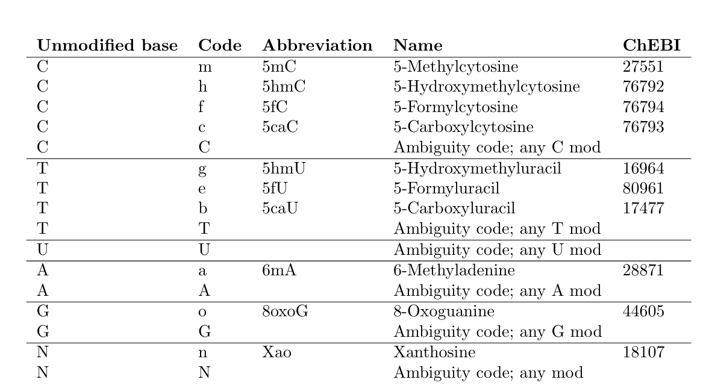

Final version
{: .label .label-green }

{: .important-title }
> Aim
>
> Perform an alignment of Oxford Nanopore reads to the reference genome. We will compare the results obtained with this sequencing technology with the ones obtained with Illumina sequencing technology.
> 


<br>
<details open markdown="block">
  <summary>
    <strong>Table of contents</strong>
  </summary>
  {: .text-delta }
- TOC
{:toc}
</details>
<br>


During this lesson we will focus on the alignment of ONT reads to the reference genome. ONT sequencing enable the direct detection of methylation levels, without the need of bisulfite conversion. The alignment of the reads is performed using `minimap2`. This tool is specifically designed for long-range sequencing data and is able to handle the unique characteristics of ONT data. 

---

Connect to the server and set the working directory
```bash
# Activate the conda environment
conda activate epigenomics

# Set the working directory
cd /data2/student_space/st24_16_folder/epigenomics/

# Create the required directories 
mkdir -p ont/sequences ont/reference
```
<br>

# 1. Prepare the reads for alignment
ONT sequencing data need to be in the appropriate format (usually `fastq` or `fasta` or `bam`). 
The output of nanopore sequencing may be available in different formats. 

We will use an input that is in bam format. We need to convert it to [fastq format](2a1_file_formats.html#fastq).

<br>

{: .highlight-title}
> Question
>
> How do we convert a bam to fastq?
>

<details>
    <summary><strong>Show answer</strong></summary>

<br>
We can take a look at the options of samtools.
<br>
Open the short help of samtools:

<code>samtools</code>


<pre><code class="language-bash">
    -- File operations
         collate        shuffle and group alignments by name
         cat            concatenate BAMs
         consensus      produce a consensus Pileup/FASTA/FASTQ
         merge          merge sorted alignments
         mpileup        multi-way pileup
         sort           sort alignment file
         split          splits a file by read group
         quickcheck     quickly check if SAM/BAM/CRAM file appears intact
         fastq          converts a BAM to a FASTQ
         fasta          converts a BAM to a FASTA
         import         Converts FASTA or FASTQ files to SAM/BAM/CRAM
         reference      Generates a reference from aligned data
         reset          Reverts aligner changes in reads
</code></pre>


<br>   
We can use the following command  
<code>samtools fastq</code>
</details>

-

The input file is located here:
`/data2/biotecnologie_molecolari_magris/epigenomics/ont/rkatsiteli.leaves.ont.bam`

Take a look to the file content

```bash
samtools view \
/data2/biotecnologie_molecolari_magris/epigenomics/ont/rkatsiteli.leaves.ont.bam | \
less
```
---

`MM:Z` and `ML:B` optional bam tags are of paramount importance, because they hold the methylation information. They are generated by the ONT software that convert the signals to nucleotides.

For a detailed description refer to [SAM/BAM format specification](https://samtools.github.io/hts-specs/SAMtags.pdf#page=7), section **1.7 Base modifications**.

Each modified base prediction has a quality value associated with it, which should be interpreted as the likelihood of the modification being correct, given the assumption the original call is correct. 

#### **MM:Z**{: .fs-3 }
{: .no_toc }

First character is the unmodified base reported by the sequencing instrument for the top strand (`A`, `C`, `G`, `T`, `U` or `N`), followed by +/- indicating the strand the modification was observed (relative to the original strand of SEQ), and by one or more base modifications codes (for example *m* or *h*). 



For more details about ChEBI - Chemical Entities of Biological Interest (ChEBI) is a freely available dictionary of molecular entities focused on ‘small’ chemical compounds. [https://www.ebi.ac.uk/chebi/](https://www.ebi.ac.uk/chebi/)


Usually a `?` is following, and no information is available about the modification status of the skipped bases. Afterwards a comma separated list of how may bases in the read of the previously stated *base type* to skip (starting with 0). 

For example:

`C+m?,5,12,0` 


It tells us that there are 3 Cs called (as either modified or unmodified) on the top strand. The first 5 Cs are unknown, while the 6<sup>th</sup>, 19<sup>th</sup> and 20<sup>th</sup> are called Cs. 12 Cs between 6<sup>th</sup> and 19<sup>th</sup> are unknown. 


<!--
https://github.com/samtools/hts-specs/blob/a6a4504917a1b02197538f21e1b441c3f3892be4/SAMtags.tex#L517
-->

#### **ML:B**{: .fs-3 }
{: .no_toc }

The tag lists the probability of each modification listed in the MM tag being correct, in the order they occour. Probability range between 0 and 1 and is remapped in equal sized portions to the discrete integers 0 to 255 inclusively. The probability range corresponding to integer value N is N/256 to (N+1)/256. 

Suppose having the following values:

`MM:Z:C+m,5,12;C+h,5,12;` may have an associated tag of `ML:B:C,204,89,26,130`.
These probabilities should not sum to above 1.0 (≈256 ininteger encoding, allowing for some minor rounding errors), but may sum to a lower total with the remainder representing the probability that none of the listed modification types are present. In the example used above, the 6<sup>th</sup> C has 80% chance of being 5mC, 10% chance of being 5hmC and 10% chance of being an unmodified C.


---

```bash
# Define the number of threads
threads=2

# Chek the options that we need 
samtools fastq 

# Convert the bam file to fastq 
samtools fastq \
-@ ${threads} \
-T MM,ML \
/data2/biotecnologie_molecolari_magris/epigenomics/ont/rkatsiteli.leaves.ont.bam \
> ont/sequences/rkatsiteli.leaves.ont.fastq
```

{: .success-title }
>STDOUT
>
>[M::bam2fq_mainloop] discarded 0 singletons
>[M::bam2fq_mainloop] processed 24817 reads
>


# 2. Align the reads to the reference genome 
We will use `minimap2` to align the reads to the reference genome. The reference genome need to be first indexed appropriately.

We will use the same reference sequence used in the previous tutorial. 

```bash
# copy the fasta file to the reference directory
cp \
/data2/biotecnologie_molecolari_magris/epigenomics/wgbs/reference/vitis_vinifera.fasta \
ont/reference/
```

### Index the reference sequence using Minimap2
```bash
minimap2 \
-x map-ont \
-d ont/reference/vitis_vinifera.fasta.mmi \
ont/reference/vitis_vinifera.fasta
```

### Align the fastq to the reference genome 
{: .no_toc}

```bash
# Create the alignment directory
mkdir -p ont/alignments/

minimap2 \
-x map-ont \
-t ${threads} \
-y \
-L \
ont/reference/vitis_vinifera.fasta.mmi \
ont/sequences/rkatsiteli.leaves.ont.fastq \
> ont/alignments/rkatsiteli.leaves.ont.sam
```

{: .success-title }
>STDOUT
>
>[M::main] Version: 2.28-r1209
>
>[M::main] CMD: minimap2 -x map-ont -t 2 -y ont/reference/vitis_vinifera.fasta.mmi ont/sequences/rkatsiteli.leaves.ont.fastq
>
>[M::main] Real time: 61.873 sec; CPU: 123.004 sec; Peak RSS: 0.892 GB

<br>

{: .highlight-title}
> Question
>
> Check the file obtained, have you spotted any difference? 
>


<details>
    <summary>Show answer</summary>
<br>

The default output of minimap2 is in <code>PAF</code> format, and you can find a detailed description <a href="https://gabbo89.github.io/EEA2024-2025/docs/2a1_file_formats.html#paf">here</a>


</details>

-
<a id="paf-format"></a>

Thus we need to add the option `-a` to obtain an output in sam format
```bash
# Rerun the alignment
minimap2 \
-a \
-x map-ont \
-t ${threads} \
-y \
-L \
ont/reference/vitis_vinifera.fasta.mmi \
ont/sequences/rkatsiteli.leaves.ont.fastq \
> ont/alignments/rkatsiteli.leaves.ont.sam
```

{: .success-title }
>STDOUT
>
>[M::main] Version: 2.28-r1209
>
>[M::main] CMD: minimap2 -a -x map-ont -t 2 -y -L ont/reference/vitis_vinifera.fasta.mmi ont/sequences/rkatsiteli.leaves.ont.fastq
>
>[M::main] Real time: 347.258 sec; CPU: 695.764 sec; Peak RSS: 2.387 GB


### Convert the (unsorted) sam to a sorted bam file 
{: .no_toc}

In order to proceed with downstream analysis, we need to convert the sam to binary format

```bash
# Define the number of threads
threads=2

# Convert the sam to bam file and sort by coordinates 
samtools view -b ont/alignments/rkatsiteli.leaves.ont.sam | \
samtools sort \
-@ ${threads} \
--write-index \
-o ont/alignments/rkatsiteli.leaves.ont.sort.bam
```


{: .success-title }
>STDOUT
>
>[bam_sort_core] merging from 1 files and 2 in-memory blocks...


# 3. Observe interactively the alignments
Now we have at our disposal both the alignments obtained with **WGBS** technology and **ONT** technology. Let's have a look at the differences on `igv`.

```bash
igv
```

Load on igv the following files:

```r
wgbs/reference/vitis_vinifera.fasta #reference file 
wgbs/alignments/rkatsiteli.leaves_pe.deduplicated.sort.bam #wgbs alignment file 
ont/alignments/rkatsiteli.leaves.ont.sort.bam #ont alignment file 

```
And jump to the following coordinate:
chr05:24461000-24462000

The same can be achieved from the command line

```bash
igv \
-g wgbs/reference/vitis_vinifera.fasta \
-l chr05:24461000-24462000 \
wgbs/alignments/rkatsiteli.leaves_pe.deduplicated.sort.bam \
ont/alignments/rkatsiteli.leaves.ont.sort.bam \
-n wgbs,ont
```

The option `-n` is used to specify the name of the tracks. In this case, we have respectively two tracks: `wgbs` and `ont`. The `-g` option is used to specify the reference file . The `-l` option is used to specify the region of interest. 


Since the version of igv available in the `epigenomics` conda environmente is not the latest, due to conflict with the libraries of other tools, not all features are available. There is a different conda environment available with a recent version of igv. To activate it, you can use the following command:

```bash
conda activate igv
```

This will open a new enviroment where a recent versione of igv is available. You can use the same command as above in order to visualize the content of the bam files.


```bash
igv \
-g wgbs/reference/vitis_vinifera.fasta \
-l chr05:24461000-24462000 \
wgbs/alignments/rkatsiteli.leaves_pe.deduplicated.sort.bam \
ont/alignments/rkatsiteli.leaves.ont.sort.bam \
-n wgbs,ont
```

Now you are able to change the colors of the methylation status and for example discriminate between methylated and un-methylated positions in the ont track.

Remember to deactivate the environment in order to go back to the previous one (epigenomics)
```bash
conda deactivate 
```

# 4. Extract methylation informations 
We will use `modkit` to extract the methylation informations from the aligned reads. For a short or detailed description checks respectively [Modkit short manual][Modkit short manual]{: .btn } and [Modkit on Github][Modkit_github]{: .btn }

### Create the bedMethyl tables 
{: .no_toc}

A primary use of `modkit` is to create summary counts of modified and unmodified bases in an extended bedMethyl format. bedMethyl files tabulate the counts of base modifications from every sequencing read over each aligned reference genomic position. Only **primary alignments** are used in generating the table, it is recommended to mark duplicate alignments before running as multiple primary alignments can be double counted (but the behavior is logged). 

Base modifications calls can be remove if they are low confidence based on the predicted modification probabilities. 
In general, `modkit` will estimate a pass confidence threshold value based on the input data. 
Threshold values for modifications on a primary sequence base can be specified on the command line with the `--filter-threshold` option. 

For example to set a threshold for cytosine modifications at 0.8, the following option can be provided `--filter-threshold C:0.8`.


In the simples usage modkit pileup creates a bedMethyl file from a pileup file. The pileup file is generated by the alignment tool, in this case `minimap2`. The pileup file is a text file that contains the aligned reads in a tabular format. The bedMethyl file is a binary file that contains the summary counts of modified and unmodified bases. The bedMethyl file can be used to visualize the methylation pattern using tools such as IGV. 

{: .note-title }
>Description
>
>Tabulates base modification calls across genomic positions. 
>This command produces a bedMethyl formatted file. 
>
>    Usage: modkit pileup [OPTIONS] <IN_BAM> <OUT_BED>
>

##### The options we will use:
{: .no_toc}

- `--threads` Define number of threads 
- `--cpg` Output counts at CpG motifs (requires a reference sequence as well as **FAI index**)
- `--ref` Path to reference sequence in FASTA format
- `--combine-mods` Combine base modification calls, all counts are summed together
- `--combine-strands` Sum the counts from + and - strands into the counts for positive strand position

There is the need to create the `.fai` file for the reference sequence 

```bash
samtools faidx ont/reference/vitis_vinifera.fasta
```


#### Usage
{: .no_toc}

```bash
# Create the output directory
mkdir ont/meth_extr

# Run modkit pileup
modkit pileup \
--threads 2 \
--cpg \
--combine-mods \
--combine-strands \
--ref ont/reference/vitis_vinifera.fasta \
--log-filepath ont/meth_extr/rkatsiteli.leaves.CG.log \
ont/alignments/rkatsiteli.leaves.ont.sort.bam \
ont/meth_extr/rkatsiteli.leaves.CG.bedMethyl 
```

{: .success-title }
> STDOUT
>
>
> Threshold of 0.6933594 for base C is low. Consider increasing the filter-percentile or specifying a higher threshold.
>
> Done, processed 61368 rows. Processed ~23598 reads and skipped zero reads.

For a detailed description of the output check [Modkit bedMethyl file description](https://gabbo89.github.io/EEA2024-2025/docs/2a4_Modkit_manual.html#Description-of-bedMethyl-output)

<a id="modkit-bedMethyl"></a>
We can collect read-level statistics for a general overview using `modkit summary`. 
By default it only uses 10,000 reads for generating the summary. 

```bash
modkit summary \
ont/alignments/rkatsiteli.leaves.ont.sort.bam
```

```
# bases             C
# total_reads_used  7435
# count_reads_C     7435
# pass_threshold_C  0.8417969
 base  code  pass_count  pass_frac    all_count  all_frac
 C     -     2101636     0.75212187   2191834    0.7061558
 C     h     39462       0.014122441  120594     0.03885246
 C     m     653178      0.23375572   791468     0.2549918
```

We can also specify a region or other options.
For example:

```bash
modkit summary \
ont/alignments/rkatsiteli.leaves.ont.sort.bam \
--region chr05:24300000-24600000
```

```
# bases             C
# total_reads_used  4084
# count_reads_C     4084
# pass_threshold_C  0.8144531
# region            chr05:24300000-24600000
 base  code  pass_count  pass_frac    all_count  all_frac
 C     -     864812      0.7008286    898940     0.65570444
 C     h     25578       0.020727966  65610      0.04785722
 C     m     343595      0.27844343   406403     0.2964383
```

# 5. Evaluate the methylation call performance against chloroplast sequence

In order to get an estimate of the methylation call performance, we can compare the genomic methylation calls against the chloroplast calls. We can align the same data to a different reference, which include the chloroplast sequence.

Create a new reference file that includes the chloroplast sequence
```bash
# Create a directory for the new reference
mkdir -p ont/chloroplast

# Merge the two sequences, we will use the already available chloroplast sequence used for wgbs analyses
cat \
wgbs/chloroplast/chloroplast.fasta \
ont/reference/vitis_vinifera.fasta > ont/chloroplast/vitis_vinifera_chloroplast.fasta
```

Create now the index for the new reference

```bash
minimap2 \
-x map-ont \
-d ont/chloroplast/vitis_vinifera_chloroplast.fasta.mmi \
ont/chloroplast/vitis_vinifera_chloroplast.fasta
```

Perform the alignment 
```bash
# Define the number of threads
threads=2

minimap2 \
-a \
-x map-ont \
-t ${threads} \
-y \
-L \
ont/chloroplast/vitis_vinifera_chloroplast.fasta.mmi \
ont/sequences/rkatsiteli.leaves.ont.fastq \
> ont/alignments/rkatsiteli.leaves.ont.chloroplast.sam
```

{: .success-title }
>STDOUT
>
>[M::main] Version: 2.28-r1209
>
>[M::main] CMD: minimap2 -a -x map-ont -t 2 -y -L ont/chloroplast/vitis_vinifera_chloroplast.fasta.mmi ont/sequences/rkatsiteli.leaves.ont.fastq
>
>[M::main] Real time: 324.781 sec; CPU: 643.580 sec; Peak RSS: 2.460 GB


### Convert the (unsorted) sam to a sorted bam file 
{: .no_toc}

In order to proceed with downstream analysis, we need to convert the sam to binary format

```bash
# Convert the sam to bam file and soort by coordinates 
samtools view -b \
ont/alignments/rkatsiteli.leaves.ont.chloroplast.sam | \
samtools sort \
-@ ${threads} \
--write-index \
-o ont/alignments/rkatsiteli.leaves.ont.chloroplast.sort.bam
```

{: .success-title }
>STDOUT
>
>[bam_sort_core] merging from 0 files and 2 in-memory blocks...


Subset the bam file in order to extract only the reads mapping to the chloroplast
```bash
# Convert the sam to bam file and soort by coordinates 
samtools view -b \
-o ont/alignments/rkatsiteli.leaves.ont.chloroplast.only_chl.sort.bam \
--write-index \
ont/alignments/rkatsiteli.leaves.ont.chloroplast.sort.bam gi\|91983971\|ref\|NC_007957.1\| 
```
### Create the bedMethyl tables 
{: .no_toc}


There is the need to create the `.fai` file for the reference sequence 

```bash
samtools faidx ont/chloroplast/vitis_vinifera_chloroplast.fasta
```

```bash
# Create the output directory
mkdir ont/meth_extr_chl

# Run modkit pileup
modkit pileup \
--threads 2 \
--cpg \
--combine-mods \
--combine-strands \
--ref ont/chloroplast/vitis_vinifera_chloroplast.fasta \
--log-filepath ont/meth_extr_chl/rkatsiteli.leaves.chloroplast.CG.log \
ont/alignments/rkatsiteli.leaves.ont.chloroplast.only_chl.sort.bam \
ont/meth_extr_chl/rkatsiteli.leaves.chloroplast.CG.bedMethyl 
```

{: .success-title }
> STDOUT
>
>
> Using filter threshold 0.8925781 for C.
>
> Done, processed 59214 rows. Processed ~28161 reads and skipped zero reads.

We can collect read-level statistics for a general overview using `modkit summary`. 
By default it only uses 10,000 reads for generating the summary. 

```bash
modkit summary \
ont/alignments/rkatsiteli.leaves.ont.chloroplast.only_chl.sort.bam
```

```
# bases             C
# total_reads_used  10042
# count_reads_C     10042
# pass_threshold_C  0.93359375
 base  code  pass_count  pass_frac     all_count  all_frac
 C     -     6247434     0.9952004     6762980    0.97306305
 C     h     16259       0.0025900174  106144     0.015272086
 C     m     13871       0.002209615   81073      0.011664849
```


[Modkit short manual]: https://gabbo89.github.io/EEA2024-2025/docs/2a4_Modkit_manual.html
[Modkit_github]: https://github.com/nanoporetech/modkit

<!--
add sam st24_09
-->